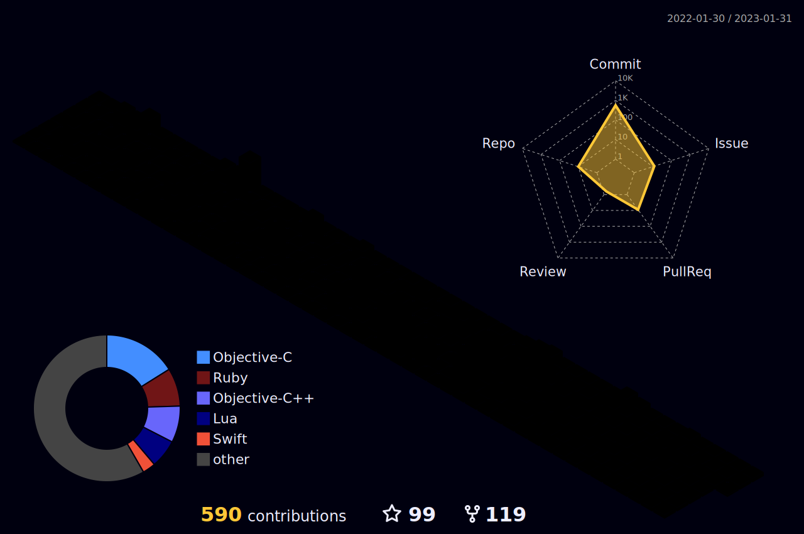
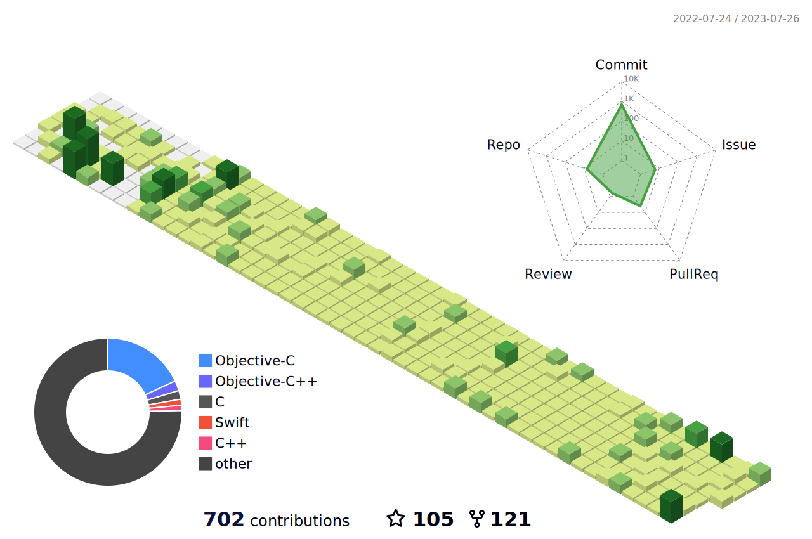
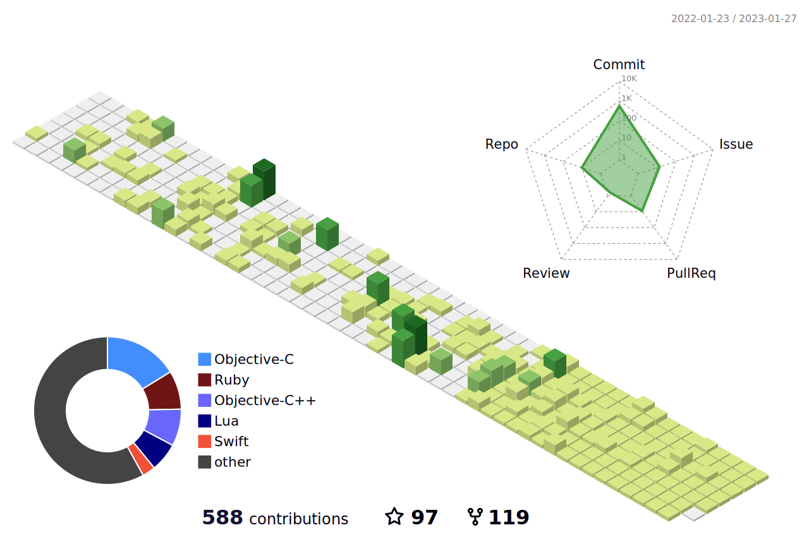
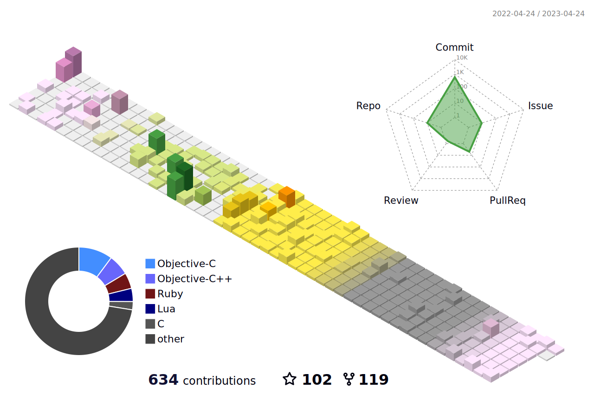
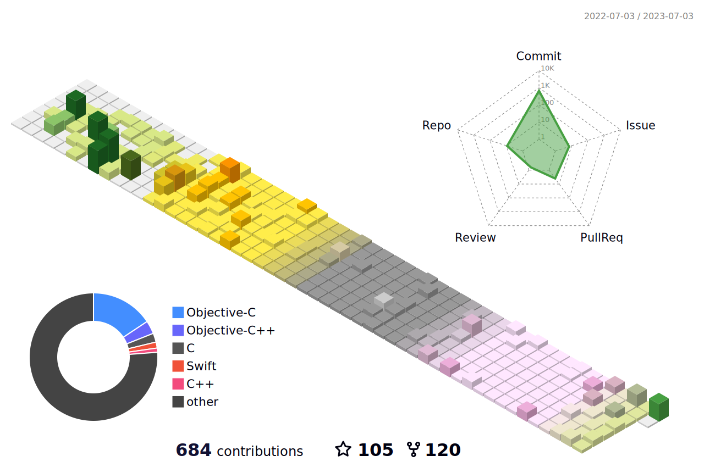
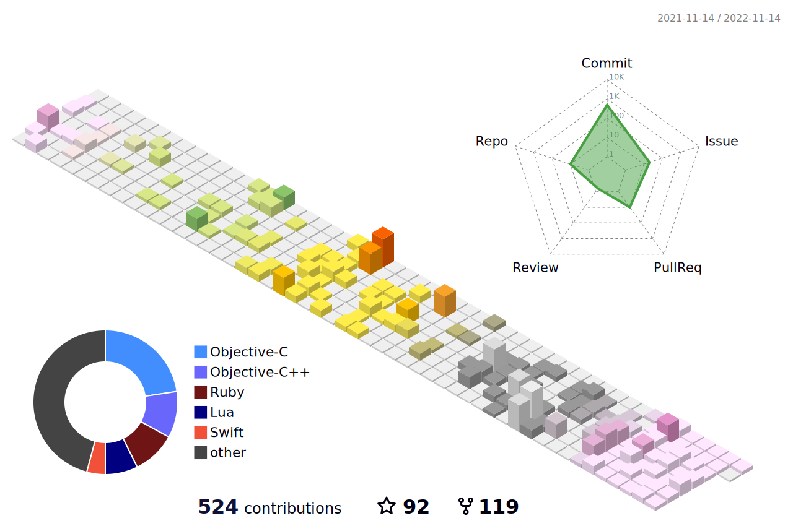
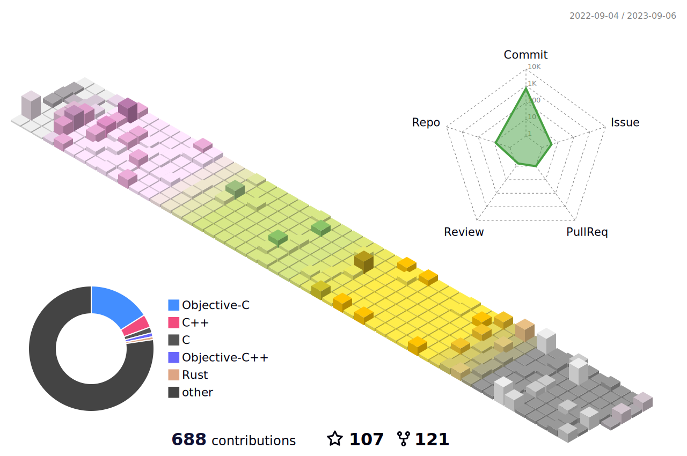
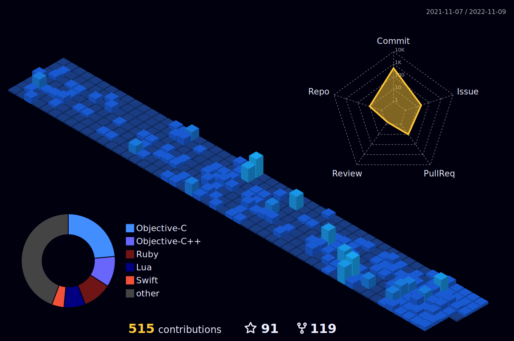
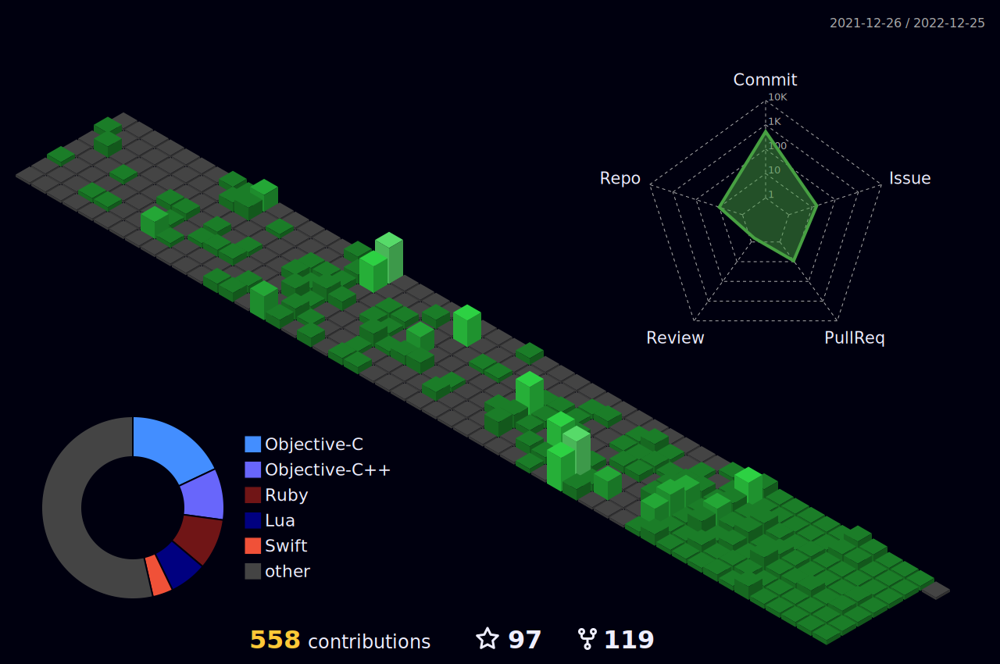
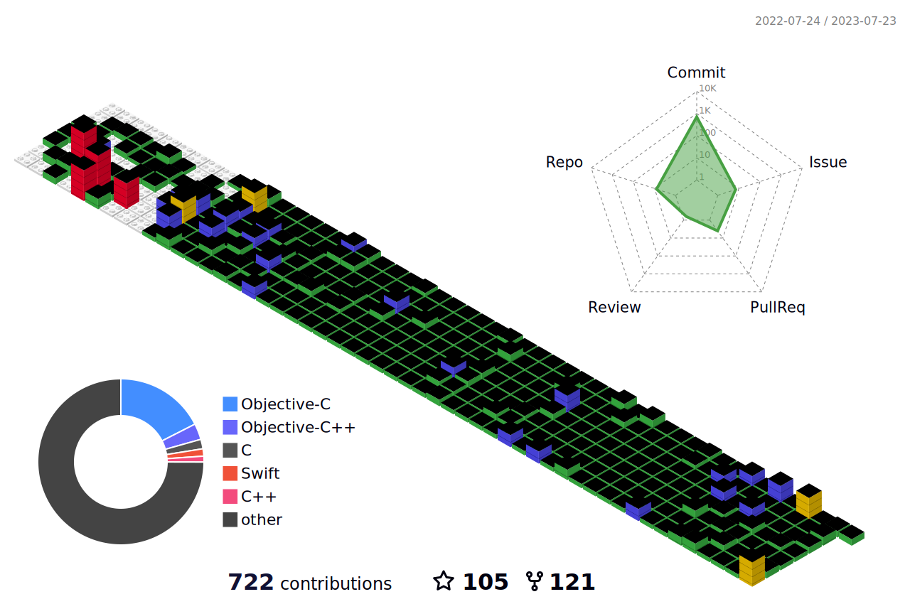

- 👋 Hi, I’m @Zero.D.Saber, is a iOSer
- 👀 I’m interested in `Swift/Rust`
- 🌱 I’m currently learning `React Native`
- 🌈 Blogger： [Zero.D.Saber's Notes](https://faimin.github.io)

<!-- 

    

-->

<!-- 
 

 
-->

<!---
faimin/faimin is a ✨ special ✨ repository because its `README.md` (this file) appears on your GitHub profile.
You can click the Preview link to take a look at your changes.
--->
