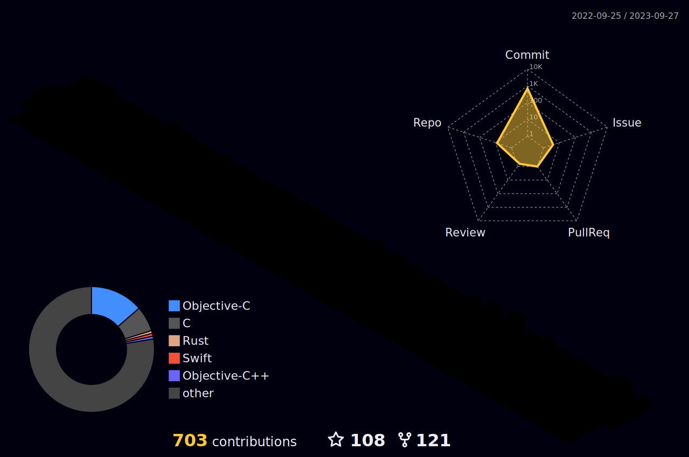
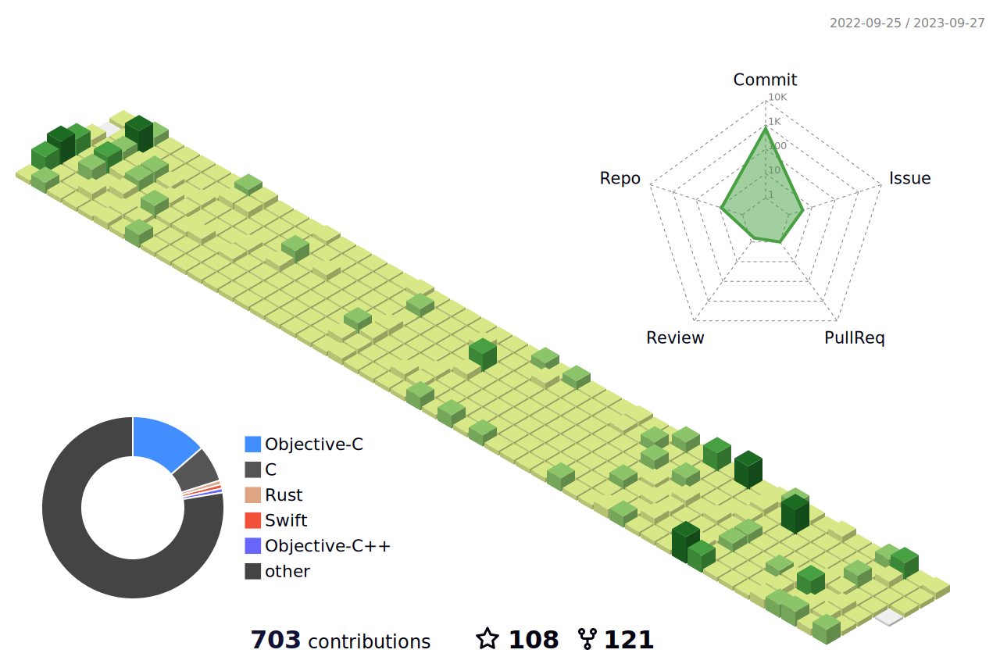
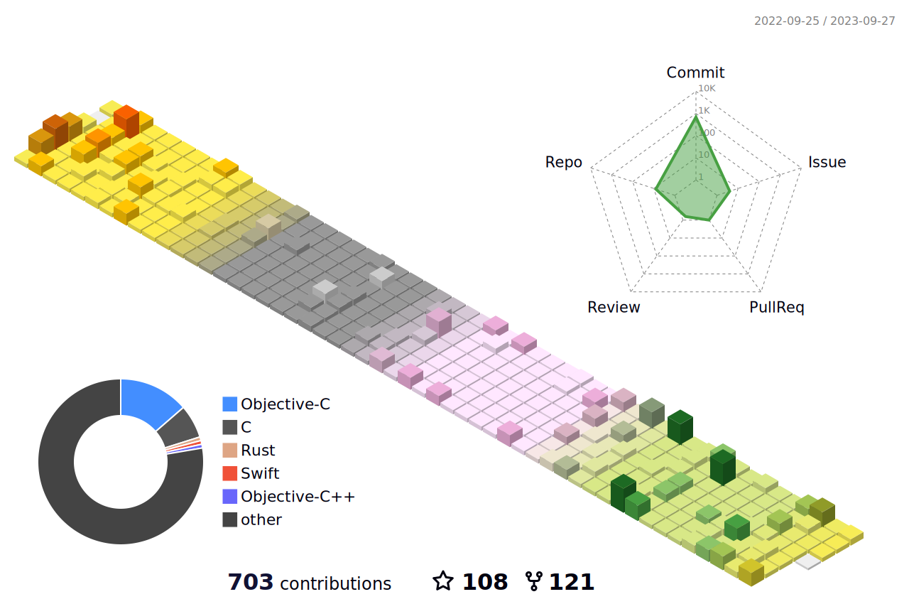
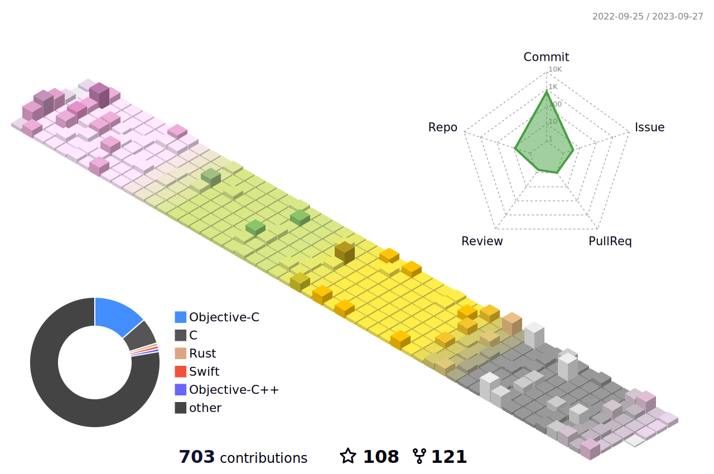
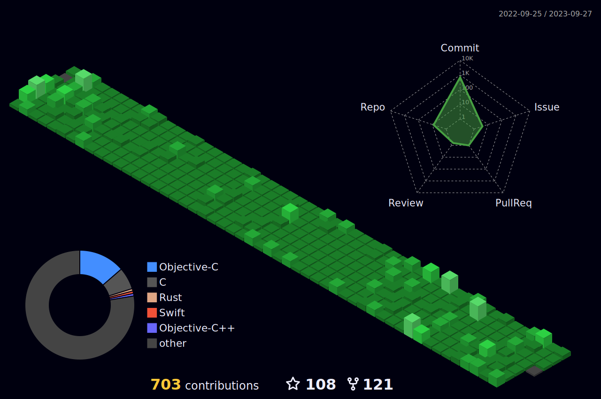

- 👋 Hi, I’m @Zero.D.Saber
- 👀 I’m interested in `Rust`
- 🌱 I’m currently learning `Rust/JavaScript`

<!-- 

 
-->

<!---
faimin/faimin is a ✨ special ✨ repository because its `README.md` (this file) appears on your GitHub profile.
You can click the Preview link to take a look at your changes.
--->
